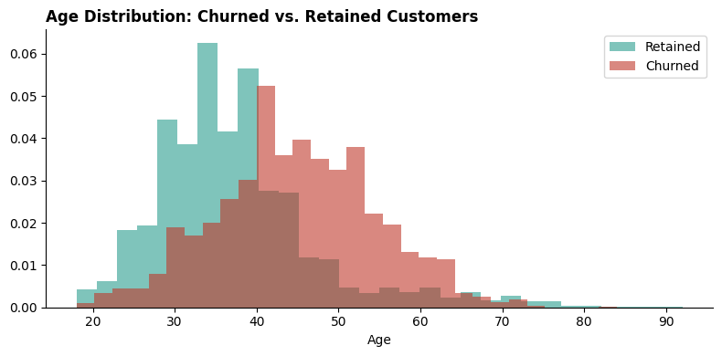
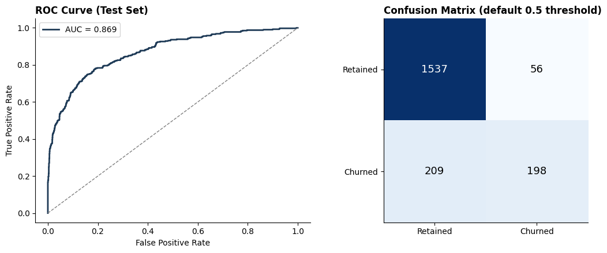
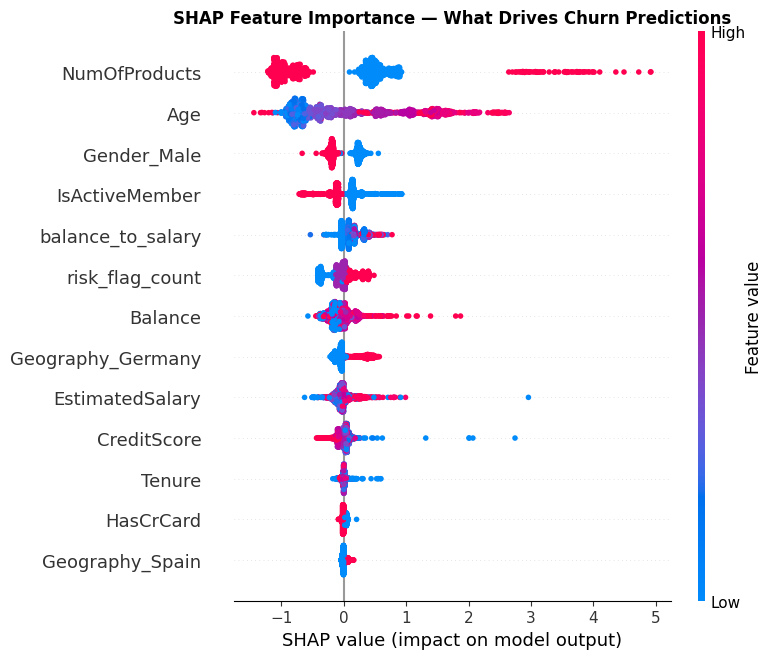
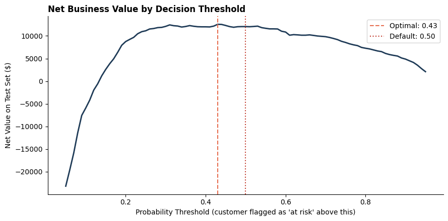
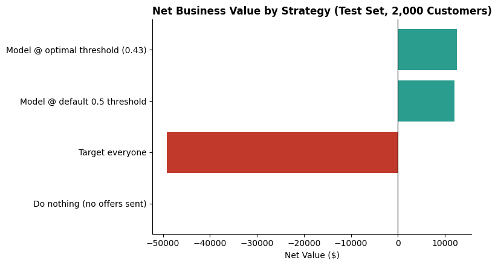

# PrimeBank Customer Retention Intelligence


## Business Problem

PrimeBank's retention team had a churn problem but no way to answer two
questions: which customers are actually at risk, and is it even profitable
to do something about it. This project builds a full pipeline from raw
customer data to an explainable prediction tool tied to a real business
economics case — not just a model with an accuracy score.

## Dataset

Real, publicly available bank customer dataset — 10,000 customers across
France, Germany, and Spain. Fields include credit score, geography, age,
tenure, balance, products held, and churn outcome. Customer names were
removed before any analysis — no PII is used or stored.

**A note on dataset choice:** this is a well-known public dataset used in
many introductory ML tutorials. I chose it deliberately as a common starting
point, then went well past where most tutorials stop — formal hypothesis
testing (not just charts), SHAP explainability, and a cost-sensitive business
economics analysis most treatments of this dataset skip entirely. The value
here is in the depth of the analysis, not the novelty of the source data.

## Key Statistically-Validated Findings



1. **Germany churns at 32.4%** vs. 16-17% in France/Spain — confirmed with a chi-square test (p ≈ 3.8×10⁻⁶⁶), not a coincidence of this sample.
2. **Customers holding 3+ products churn at 82-100%** — counter-intuitively, product depth is a red flag, not a loyalty signal.
3. **Churned customers are significantly older** on average (44.8 vs. 37.4 years, t-test p ≈ 4.7×10⁻¹⁷⁹).
4. Zero-balance customers actually churn **less** than average — not every intuitive risk factor holds up under testing.

**SQL highlight** (compound risk scoring — full query in [`SQL/02_analysis_queries.sql`](SQL/02_analysis_queries.sql)):
```sql
(CASE WHEN is_active_member = 0 THEN 2 ELSE 0 END) +
(CASE WHEN num_products >= 3 THEN 2 ELSE 0 END) +
(CASE WHEN age >= 50 THEN 1 ELSE 0 END) +
(CASE WHEN geography = 'Germany' THEN 1 ELSE 0 END) AS risk_score
```

## Model Performance



| Model | Cross-Validated ROC-AUC |
|---|---|
| Logistic Regression | 0.799 |
| Random Forest | 0.859 |
| **Gradient Boosting (selected)** | **0.863** |

Final model, evaluated once on a held-out test set: **ROC-AUC 0.869**.

## Explainability (SHAP)



Every prediction comes with a stated reason — not a black-box score.

## Business Economics



| Strategy | Net Value (Test Set) |
|---|---|
| Do nothing | $0 |
| Target everyone | -$49,125 |
| Model @ default 0.5 threshold | $12,050 |
| **Model @ optimal threshold (0.43)** | **$12,550** |

Scaled to the full 10,000-customer base: **~$62,750/year in projected net value.**



**On the assumptions behind this:** the $500 annual customer value figure
isn't an arbitrary round number — it's derived from this dataset's actual
average account balance ($76,486) at an illustrative 0.65% net interest
margin (a plausible retail banking figure), which computes to ~$497,
rounded to $500. The $50 offer cost and 25% success rate remain stated
assumptions that a real deployment would replace with the bank's actual
finance-team figures and a validated A/B test result.

## Interactive App (Code Included)

An interactive Streamlit app is included in `/app` — enter a hypothetical
customer's profile and get an instant churn risk score with a SHAP
explanation. Run locally with `streamlit run app/app.py`.

## Critical Assessment & Next Steps

A model that stops at "here's the ROC-AUC" isn't finished — here's what I'd
flag before this goes anywhere near production, and what I'd do next.

**Limitations of this analysis:**
- This is a single snapshot, not longitudinal data — I can't see *when* in a
  customer's lifecycle they churned, which rules out proper survival/time-to-event
  modeling. With transaction-level history, a Cox proportional hazards model
  would tell us not just *who* churns but *when*, which changes how retention
  outreach gets timed.
- The offer-cost and success-rate figures remain stated assumptions, not
  measured facts. Before committing budget, I'd want the retention offer's
  actual success rate validated with a proper A/B test, not estimated.
- The model uses Age and Geography as features. In a regulated lending
  context, that's worth a second look — I'd run a disparate impact check
  before deployment to confirm the model isn't creating an outcome that's
  legally or ethically indefensible, even if statistically predictive.

**What I'd do with more time or access:**
- Build separate models per geography instead of one global model — Germany's
  churn dynamics look structurally different from France/Spain's, and a
  segmented approach would likely outperform a one-size-fits-all model.
- Add behavioral features (app logins, support tickets, NPS scores) — pure
  demographic and account data caps out how predictive this model can get;
  engagement data is almost always the bigger lever.
- Set up drift monitoring and a quarterly retraining cadence — churn drivers
  shift as competitors and rates change, and a model frozen in time quietly
  decays without anyone noticing until performance visibly drops.
- Deploy the app publicly and validate the offer economics with a real
  holdout A/B test before scaling retention spend.

I'd rather flag these gaps upfront than let a clean ROC-AUC number imply more
certainty than the data actually supports.

## Project Contents

| Folder | Contents |
|---|---|
| [`SQL/`](SQL) | Schema + 8 analysis queries (risk scoring, pay/product segmentation) |
| [`notebooks/`](notebooks) | EDA & statistical testing, model development, business economics |
| [`models/`](models) | Trained model (churn_model.pkl) |
| [`app/`](app) | Streamlit app (app.py, requirements.txt) |
| [`data/`](data) | Cleaned dataset (PII-free) |

## Tools & Techniques

SQL (window functions, CASE-based risk scoring) · Statistics (chi-square tests, t-tests, confidence intervals) · Machine Learning (cross-validation, model comparison, class imbalance handling) · SHAP explainability · Business economics (cost-sensitive decision thresholds) · Streamlit app development

---

© 2026 Temaje Zakaria. All rights reserved.
